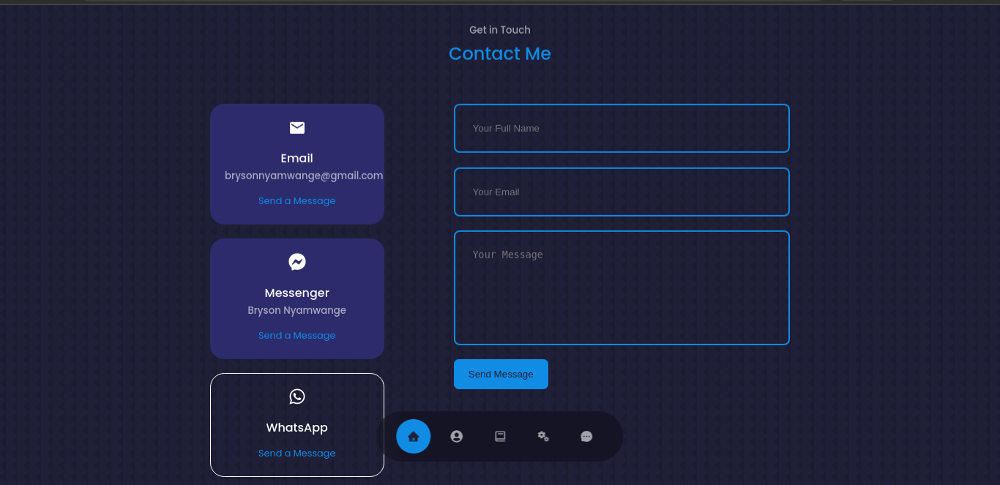

# Portfolio - This is my personal portfolio site

## Portfolio Link: https://my-portfolio-six-beta.vercel.app/

This is my portfolio created with React and it has the following sections:

## About

Displays information about me

## Contact

Contains contact information and how to reach me. Please lest have a chat!

## Experience

Showcases my level of experience coupled with projects I have undertaken

## Header

Contains my information and CV

 

 <h2>General Use</h2> 

1. First clone this repository.

2. Once the repository is cloned run npm start

## Author :black_nib:
* **Bryson Nyamwange** <[brysonwaisi](https://github.com/brysonwaisi)>